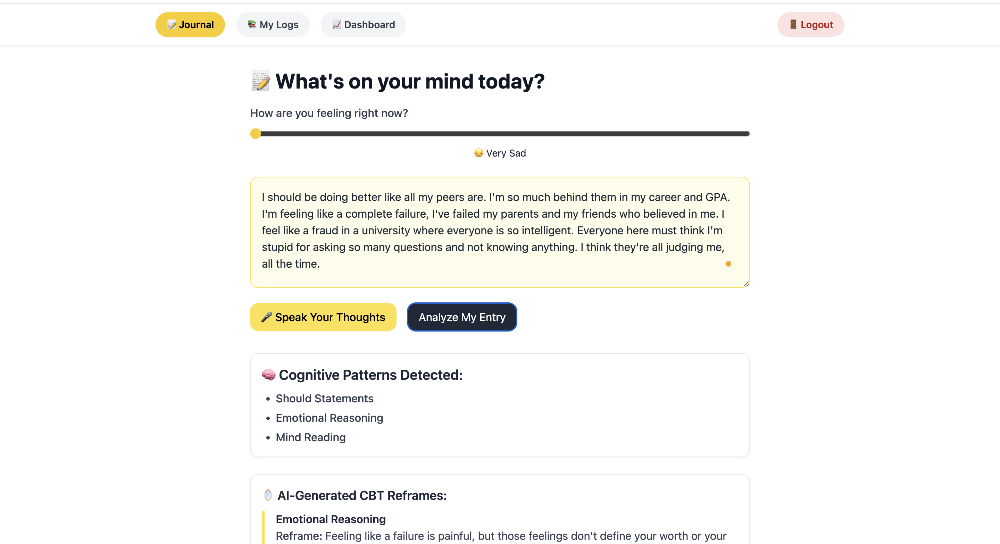
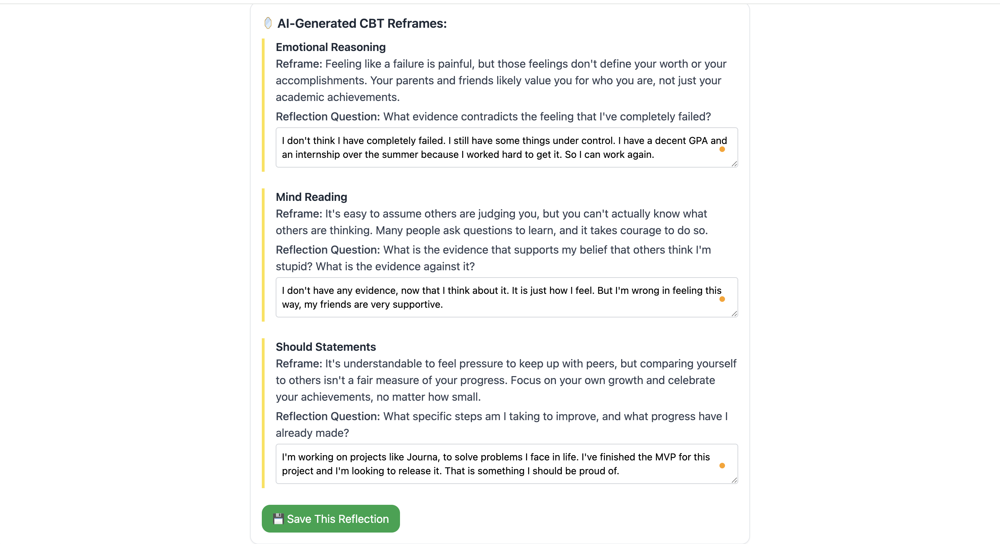
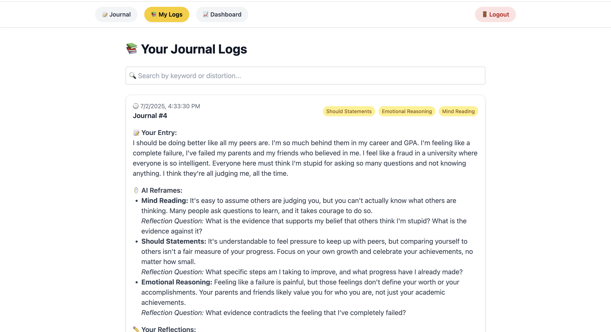
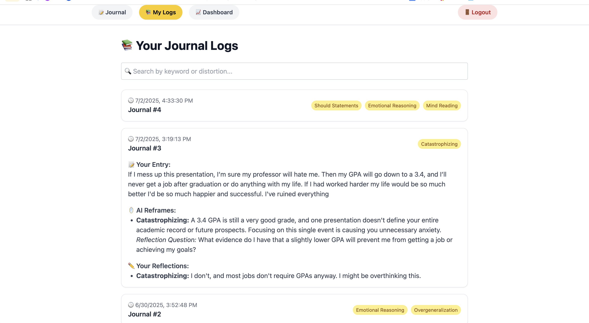
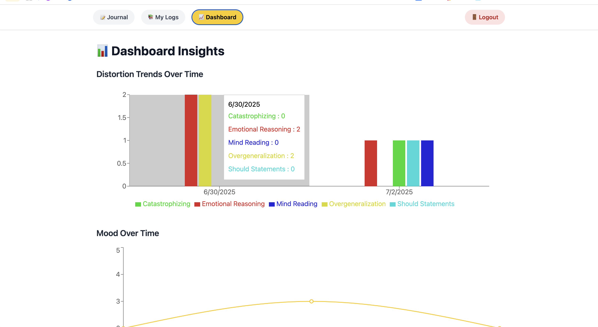

# 🧠 AI-Powered CBT Journal Web App

A full-stack web application that helps users self-reflect using **Cognitive Behavioral Therapy (CBT)** techniques, **speech-to-text journaling**, **AI-powered cognitive distortion detection**, and **personalized reframing suggestions**.

Built using a **fine-tuned Cohere classification model** for distortion detection and **Google Gemini** for personalized AI reframes.

## 📸 Screenshots & Features

### 📝 Speech-to-Text Journaling

Users can speak their thoughts — the Web Speech API transcribes them into journal entries.

---

### 🤖 AI-Powered Distortion Detection

Fine-tuned Cohere model highlights cognitive distortions like Catastrophizing, Emotional Reasoning, etc.

---

### 💬 Personalized Reframing Suggestions

Google Gemini generates CBT-style thought-challenging reframes based on your journal.

---

### 📓 Smart Journal Logs  

Journal entries are saved with timestamps, mood ratings, detected distortions, and personalized AI feedback. Users can search entries by keyword or distortion tag, and expand/collapse each log for a clean, focused journaling experience.

---

### 📈 Mood Tracker & Analytics Dashboard

Visualizations of your cognitive distortion trends and mood over time.

---

## 🚀 Features

- ✅ **Speech-to-text journaling** (Web Speech API)  
- ✅ **ML-based cognitive distortion detection** (Cohere fine-tuned classification model)  
- ✅ **Personalized CBT reframes and thought-challenging questions** (Google Gemini API)  
- ✅ **User reflections saved alongside AI feedback**  
- ✅ **Mood tracking (1-5 scale slider per entry)**  
- ✅ **User authentication** (Supabase Auth)  
- ✅ **Per-user journal logs** with:
  - Search by keyword or distortion type
  - Expand/collapse views
  - Timestamps and distortion tags  
- ✅ **Analytics Dashboard:**
  - 📊 Distortion frequency trends over time (bar chart)
  - 📈 Mood trends over time (line chart)

---

## 🧠 AI / NLP Highlights

- **Cohere Fine-Tuned Model:**  
Custom-trained classifier to detect cognitive distortions (like Emotional Reasoning, Catastrophizing, etc.) in journal entries.

- **Gemini AI for Reframing:**  
Dynamic prompt engineering feeds each user’s journal entry and detected distortions into Gemini to generate **personalized CBT-style reframes** and **thought-challenging reflection questions**.

- **Mood Tracking Integration:**  
User mood (1–10) saved per journal and visualized in the dashboard.

---

## 📈 Dashboard Visualizations

- **Cognitive Distortion Trends Over Time:**  
Bar chart showing how frequently each cognitive distortion appears across user entries, grouped by day.

- **Mood Trends:**  
Line chart visualizing mood scores across time.

---

